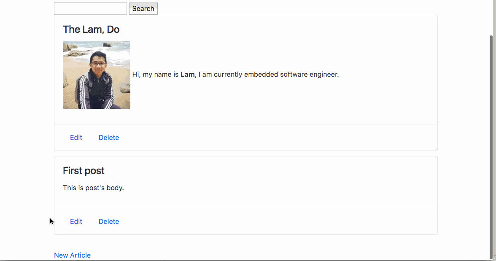

# Pre-work - *MyBlog*

**MyBlog** is a Ruby on Rails blog application.

Submitted by: **Lam Do**

Time spent: **30** hours spent in total

URL: **https://nekblog.herokuapp.com/articles**

## User Stories

The following **required** functionality is complete:

* [x] User can create a new post, formatted using the Markdown language.
* [x] User can edit an existing post.
* [x] There is one post that introduces the App Creator with name, picture.
* [x] User can delete stories, with an alert that asks the user to confirm.
* [x] User see a search form on the Posts page.
* [x] User can submit a search term to find all posts bywith titles containing the search term.

The following **optional** features are implemented:
* [x] There is a "navbar" that is responsive to window size similar to http://v4-alpha.getbootstrap.com/examples/navbar/. 
* [x] User can see how many views a post has. 
* [ ] User can leave a comment on a post.
* [ ] User can add "tags" to a post, and filter posts by tag. 

> HINT: if you are unsure how to implement the Search feature, you can Google how to implement a simple search form. For example, one of the sites you will find is [this](http://www.jorgecoca.com/buils-search-form-ruby-rails/)

The following **additional** features are implemented:

- [x] Search function so it don't care about uppercase or lowercase
## Video Walkthrough 

Here's a walkthrough of implemented user stories:

GIF created with [LiceCap](http://www.cockos.com/licecap/).

## Notes

Describe any challenges encountered while building the app.